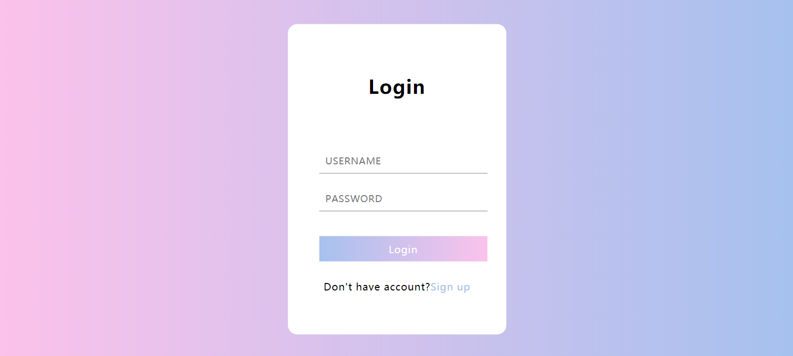

<a href="https://github.com/weijiew/web-step"></a>

[github pages](https://weijiew.com/web-step/) 在线版。 代码都在 docs 文件中。

# 下载方式

可以使用 git bash 直接 clone 本厂库。
```bash
git clone https://github.com/weijiew/web-step.git
```

也可以直接复制下面这个链接，直接下载。
```bash
https://codeload.github.com/weijiew/web-step/zip/master
```

如果在国内图片加载不出来的话，可以考虑查看这个[回答](https://www.zhihu.com/question/32885190/answer/1222916367)

# demo-01 登陆界面
效果： 


[来源](https://www.bilibili.com/video/BV1fE411b7Fv)

# demo-02 图标框

[来源](https://www.bilibili.com/video/BV1U7411C78K)

# demo-03 图标+果冻效果


[来源](https://www.bilibili.com/video/BV1e7411y75m)

# demo-04 打字机hover效果
效果：


[来源](https://www.bilibili.com/video/BV1bz411b7j7)


# demo-05 爱心


[来源](https://www.bilibili.com/video/BV1ba4y1475n)

# demo-06 登陆界面


[来源](https://www.bilibili.com/video/BV1tA411h7id/)

# demo-07 搜索框


# demo-08 信封


# demo-09 圆环


[来源](https://www.bilibili.com/video/BV1Pf4y127tU)

# 声明
仅供学习参考，这个本人在学习 html/css/js 时发现的比较好看的项目，收集了起来，参考链接的 up 主大多也是搬运别人的，出处不详，如果侵犯到了您的权益，请联系我 (jiewei1999@qq.com) ，我将立刻删除。


# 更新
> update 2020/5/24 增加了 [github pages](https://weijiew.com/web-step/) 页面 图标正在精心筛选。 